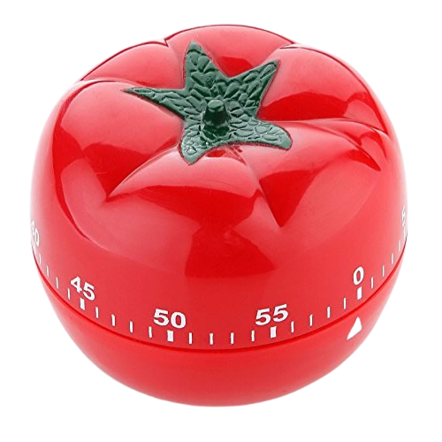

## pomodoroClock

### This project was bootstapped with a keyboard.

### Technical Description

- HTML
- CSS
- Vanilla JavaScript
- [ProgressBar.js](https://progressbarjs.readthedocs.io/en/latest/)

### Installation instructions

- Not needed unless you do not have an IDE and / or browser.

### Usage

1. Enter a task name
2. Start the clock
3. After 25 minutes, you automatically get a 5 minute break
4. Then the next task starts
5. Repeat step 1

### Technique Description

The Pomodoro Technique is a time management method developed by [Francesco Cirillo](https://francescocirillo.com/) in the late 1980s. The technique uses a timer to break down work into intervals, traditionally 25 minutes in length, separated by short breaks. Each interval is known as a pomodoro, from the Italian word for 'tomato', after the tomato-shaped kitchen timer [that] Cirillo used as a university student.

There are six steps in the original technique:

1. Decide on the task to be done.
2. Set the pomodoro timer (traditionally to 25 minutes).
3. Work on the task.
4. End work when the timer rings and put a checkmark on a piece of paper.
5. If you have fewer than four checkmarks, take a short break (3–5 minutes) and then return to step 2; otherwise continue to step 6.
6. After four pomodoros, take a longer break (15–30 minutes), reset your checkmark count to zero, then go to step 1.

For the purposes of the technique, a pomodoro is the interval of time spent working.

Regular breaks are taken, aiding assimilation. A short (3–5 minutes) rest separates consecutive pomodoros. Four pomodoros form a set. A longer (15–30 minute) rest is taken between sets.

A goal of the technique is to reduce the impact of internal and external interruptions on focus and flow. A pomodoro is indivisible; when interrupted during a pomodoro, either the other activity must be recorded and postponed (using the inform – negotiate – schedule – call back strategy) or the pomodoro must be abandoned.

After task completion in a pomodoro, any time remaining could be devoted to activities such as:

1. Review and edit the work just completed.
2. Review the activities from a learning point of view: What did I learn? What could I do better or differently?
3. Review the list of upcoming tasks for the next planned Pomodoro time blocks, and start reflecting on or updating those tasks.

- Cirillo suggests:

  - Specific cases should be handled with common sense.
  - If you finish a task while the Pomodoro is still ticking, the following rule applies:
    - If a Pomodoro begins, it has to ring.
    - It’s a good idea to take advantage of the opportunity for overlearning, using the remaining portion of the Pomodoro to review or repeat what you’ve done, make small improvements, and note what you’ve learned until the Pomodoro rings.

The stages of planning, tracking, recording, processing and visualizing are fundamental to the technique. In the planning phase, tasks are prioritized by recording [them] in a **"To Do Today"** list. This enables users to estimate the effort tasks require. As _pomodoros_ are completed, they are recorded, adding to a sense of accomplishment and providing raw data for subsequent self-observation and improvement.

